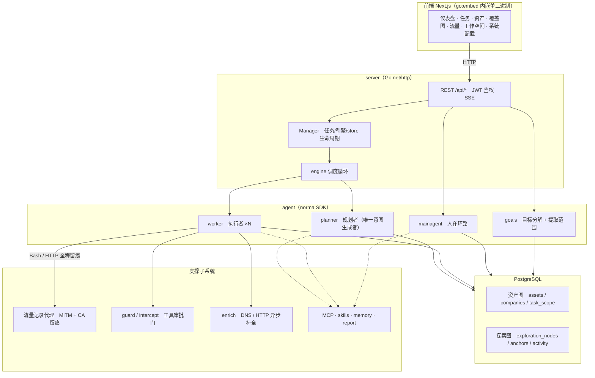
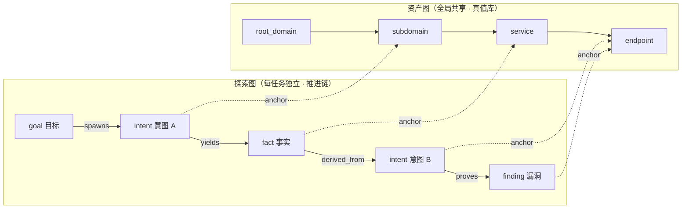
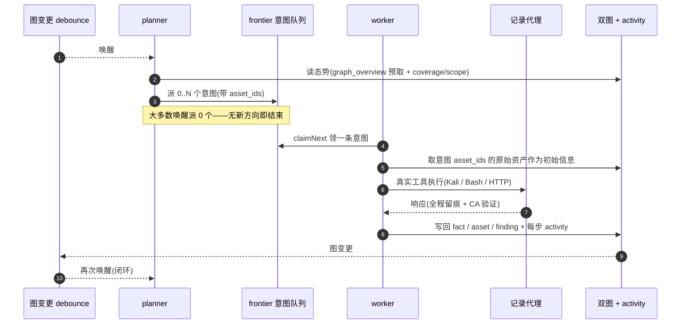
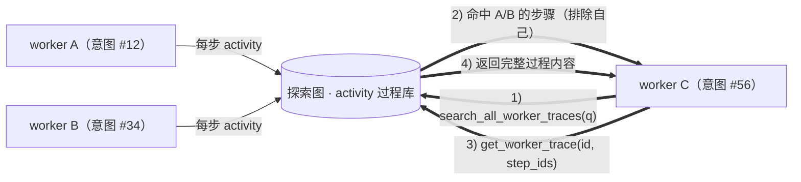
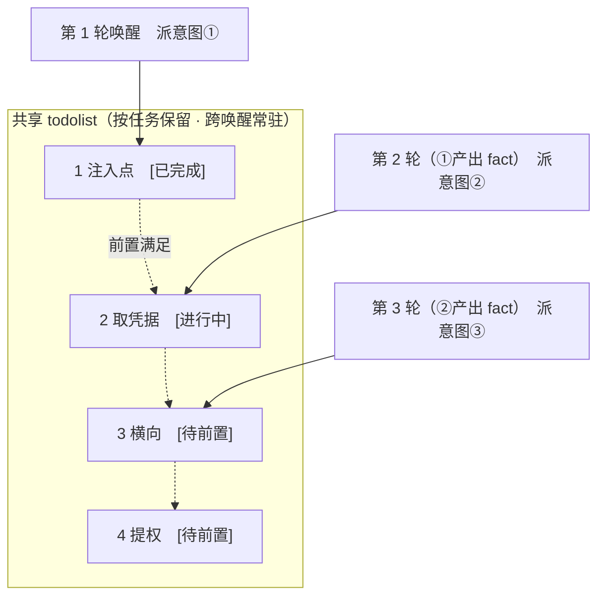

<div align="center">

# ARTEX

AI 自主渗透测试系统（Go 后端 + Next.js 前端）


🌐 **在线 Demo**： [https://artex-demo.vercel.app/](https://artex-demo.vercel.app/)

</div>

---

## 截图预览

> 完整交互见[在线 Demo](https://artex-demo.vercel.app/)。

| 仪表盘（总览 / Token 消耗 / 活动流） | 任务列表 |
| :---: | :---: |
|  |  |

| 任务 · 执行过程（会话 / 工具调用） | 探索链路 |
| :---: | :---: |
|  |  |

| 发现 | 资产 |
| :---: | :---: |
|  |  |

| 资产覆盖图（力导向布局 · 已测高亮 · 节点折叠展开） |
| :---: |
|  |

| 流量录制 | 人在环路对话 |
| :---: | :---: |
|  |  |

| Agent 管理 | LLM 配置 |
| :---: | :---: |
|  |  |

| 拦截审批 | 后端日志 |
| :---: | :---: |
|  |  |


---

## 审批记录详情

全局「审批记录」、任务内「拦截审批」及对话中的审批卡片均支持展开查看详情。展示结构参考
[AegisHook 的审批详情组件](https://github.com/RuoJi6/AegisHook/blob/main/web/src/components/CallDetail.vue)，沿用 ARTEX 的组件和主题：

- 工具请求与审批裁决左右分栏，手机端上下排列；待审批记录可在详情中允许或拒绝。
- 展开上下文可查看当前轮输入、会话记录片段、模型或规则初判、执行输出，以及调用 ID、参数/审查配置/模型输入的 SHA-256 指纹。对话审批卡片按需加载完整请求，长参数可展开复制。
- 审批状态和执行结果分别保存。模型直接允许也会记录；重复提交已处理审批返回 HTTP 409。
- 点击审批「来源」会打开对应的完整对话，自动加载到原始工具调用的位置并展开命令和输出；任务内按调用所属的 Worker、规划器或主 Agent 分段会话定位。关联使用持久化工具调用 ID，不按命令文本猜测；对话已删除会提示并留在审批页，任务或执行记录缺失也会明确提示。
- `GET /api/intercept/history/{id}` 按需读取详情，原列表接口不返回上下文和输出。数据库启动迁移自动补列；旧记录显示未记录，旧任务归档可正常恢复。

会话审计片段是工具请求产生时保存的记录，最多 24 条、每条 8 KiB；当前轮输入最多 32 KiB，执行输出最多 64 KiB，截断会明确标注。
当前 Norma SDK 的审批钩子不包含调用 ID，因此仅在当前运行中能够唯一匹配工具请求事件时关联结果；相同参数的并发调用无法唯一匹配时，会显示未关联，避免错误归属。

### 上下文模型审查

模型接收审查系统提示词和版本 4 JSON：本机工作目录、可用的简短背景、完整工具名和 JSON 参数（包括交互 Shell 的会话 ID）。模型输入与会话审计分开，历史调用不再提交审查。

- 背景仅取聊天和任务主 Agent 的当前实际用户消息（`background.source=user_message`），在添加附件清单前绑定，不调用模型生成摘要。Worker 不发送背景、意图摘要或上级 Agent 的背景；自动规划器和自动触发的会话也不附带用户背景。缺少原文时省略，不回退到整轮调度输入。
- 不主动附带任务编号、描述、目标、任务操作约束、全局探索态势或完整 Worker 意图。审查模型依照自己的操作审查策略裁决，不负责约束 Agent 的任务方向；Agent 自身仍照常接收任务信息和约束。背景和工具参数中的指令不能改变审查规则，Worker 的声明不能证明产物归属。
- 不发送历史命令、历史执行结果、历史审批理由或调用关联标记，也不从审计记录补取。背景最多 4,000 字节，超出后截断并标记；当前调用参数不截断。删改对象归属无法从当前参数确定时，按审查策略处理，不能根据背景自述假定此前已创建；普通只读动作不因缺少历史而转人工。
- 所有模型裁决（包括自动允许）的详情均保存实际提交模型的 JSON 及指纹。页面优先展示当前待审查调用，并展示背景来源、工作目录和“未发送历史调用”说明，可展开完整 JSON；任务/会话编号和 Agent 仍用于审批来源显示。旧版 v1/v2/v3 快照保留当时发送的字段及历史调用并标明旧版，只有指纹的历史记录明确提示无法还原原文，不用当前数据补造历史。较大的原始会话审计片段单独展示，不代表发送给审查模型的内容，也不重复保存在自动允许记录中。
- 模型输出 JSON 的 `decision`（allow / ask / deny）及 `comment`；三种裁决的说明均必须包含“实际操作、成功后的后果、命中规则”。缺少说明、重复字段或不完整 JSON 按已配置的模型失败策略处理，不伪造模型解释。
- 自定义审查策略保留，运行时统一追加输入信任边界和 JSON 输出协议，旧的单行输出要求由新协议替代。模型按当前操作的全部直接效果裁决，不推测历史行为；写入报告只描述保存文本，不将正文记述的上传或命令当作本次执行行为。

官方默认规则、工具拦截范围和优先级不变：仅范围内且未命中规则的调用进入已启用的模型审查。模型未启用时沿用原行为；模型调用异常仍遵循用户配置的失败策略。

可选真实模型回归：将 `judge.base_url`、`judge.api_key`、`judge.model` 放入仓库外私有 JSON，通过 `ARTEX_REVIEW_LIVE_CONFIG=/path/to/private.json go test ./server -run '^TestLiveContextReview$' -v` 运行。该测试只提交合成审查输入，不执行其中的命令；数据库测试应另行配置隔离 PostgreSQL。

## 资产同步（ScopeSentry）

支持从 [ScopeSentry](https://github.com/Autumn-27/ScopeSentry) 直接同步资产数据，免去重复收集：

- 在「**资产同步**」页填 ScopeSentry 的地址与 API Key，接入数据源；
- 按**项目**或**任务**维度选择要同步的目标与资产类型（域名 / 子域 / IP / 端口 / 站点 / 端点…）；
- 一键导入并按公司资产范围归并，直接进入 ARTEX 的资产图供 agent 探索使用。

---

## 安装

> 依赖数据库 **PostgreSQL**；探索需配置 **LLM**（`ANTHROPIC_API_KEY` 或 `OPENAI_API_KEY`，也可在 UI 里配）。

### 方式一：一键安装脚本（推荐）

```bash
git clone https://github.com/Autumn-27/ARTEX.git
cd ARTEX
./install.sh
```

脚本会：检测 / 自动安装 Docker → 让你选 **① 全部 Docker** 或 **② 本地编译运行**：

- **① 全部 Docker**：填一个 Postgres 密码（可回车随机）→ 自动写 `.env` → `docker compose up -d`。
- **② 本地运行**：选数据库（连已有 / 用 Docker 起一个）→ 生成 `config.json` → `go` 编译内嵌单二进制 → 启动。

装好后打开 **http://localhost:8787**（首次进入 `/setup` 设置管理员密码）。

### 方式二：Docker Compose（手动）

```bash
git clone https://github.com/Autumn-27/ARTEX.git
cd ARTEX
cp .env.example .env          # 填 POSTGRES_PASSWORD、可选 ANTHROPIC_API_KEY
docker compose up -d          # 拉取 autumn27/artex 镜像 + postgres
# → http://localhost:8787
```

镜像已含常用工具（ripgrep/curl/vim/npm/nmap…）；`./skills` 与 `./data` 以绑定挂载持久化。

远程 MCP 可在系统设置中选择 `http`（Streamable HTTP）或 `sse`（旧版 SSE）。
旧版 SSE 服务通常使用 `GET /sse` 建立事件流，再通过服务返回的
`/message?sessionId=...` 接收 JSON-RPC 请求；配置时将 URL 填为 `/sse`，请求头按
`Authorization=Bearer <token>` 填写。

### 方式三：下载预编译二进制（Releases）

到 [Releases](https://github.com/Autumn-27/ARTEX/releases) 下载对应平台的 zip，解压后得到 `artex` + `start.sh`（Windows 为 `start.bat`）+ `skills/` + `config.example.json`：

```bash
cp config.example.json config.json   # 填好 database 连接
./start.sh                           # → http://localhost:8787
```

> 请用 `start.sh` / `start.bat` 启动，而不是直接跑 `./artex`。它是个守护脚本：程序退出后按退出码决定是否重新拉起，**页面上的[一键更新](#方式一页面一键更新推荐)靠它完成换装**。直接运行 `./artex` 时更新完就不会被拉起了。
> 后台常驻：`nohup ./start.sh >artex.log 2>&1 &`。

#### Linux 服务器：改用 systemd 托管（推荐）

在有 systemd 的 Linux 上，可以把守护职责交给 systemd（崩溃自动拉起、开机自启、日志进 journal），不再套 `start.sh`：

```bash
# 方式 A：install.sh 本地编译路径末尾会问「安装为 systemd 服务?」，选 y 自动完成
# 方式 B：手动安装
sudo install -m644 packaging/artex.service /etc/systemd/system/artex.service
# 编辑 unit：把 User= / WorkingDirectory= / ExecStart= 改成你的部署账号与安装目录
sudo systemctl daemon-reload && sudo systemctl enable --now artex
journalctl -u artex -f    # 看日志
```

- **何时用哪个**：有 systemd 的 Linux 服务器用 unit；macOS / Windows / Docker / 无 systemd 的精简环境继续用 `start.sh` / `start.bat`。两者守护逻辑等价（退出码 0 停、75 立即重拉、其它退避重拉），**不要叠加使用**。
- **可选环境变量**（如 `ARTEX_CALLBACK_ADDR` 回连地址）写在 `/etc/artex.env`，改完 `systemctl restart artex` 生效。
- **更新流程差异**：页面一键更新、`update.sh` 本地更新在 systemd 下照常工作——程序以退出码 75 退出时，`Restart=on-failure` 会像 `start.sh` 一样把它拉起并完成换装，无需额外操作。手动换二进制则用 `sudo systemctl restart artex` 代替「重启 ./start.sh」。

### 方式四：从源码编译单二进制

```bash
# 1) 前端静态导出
cd web && npm ci && npm run build:static && cd ..
# 2) 拷进内嵌目录
cp -r web/out server/webui/dist
# 3) 编译（-tags embedui 才内嵌前端）
CGO_ENABLED=0 go build -tags embedui -o artex ./cmd/artex
./start.sh
```

### 方式五：构建跨平台 Release 压缩包

`build.sh` 会先构建并嵌入前端，再使用 Go linker 去除调试信息，并将发布文件压缩为 zip。Release 模式默认生成 Linux amd64/arm64、macOS amd64/arm64 和 Windows amd64 的 zip 包：

```bash
./build.sh --release
# 产物：dist/artex-0.3.3-*.zip
```

UPX 自解压二进制可能与部分 Linux 内核、虚拟化环境或安全策略不兼容，因此默认不启用。可用 `ARTEX_TARGETS` 自定义目标；确认目标运行环境兼容时，可显式传入 `--upx` 进一步缩小二进制：

```bash
ARTEX_TARGETS=linux/amd64,windows/amd64 ./build.sh --release
./build.sh --target linux/amd64 --upx
```

---

## 外部工具（军火库）与部署自检

平台本身只有一个二进制，但渗透能力依赖一批外部工具，统一放在 **`data/tools/`** 下（隧道工具可用环境变量覆盖路径）：

| 工具 | 用途 |
| --- | --- |
| suo5 / suo5-payloads | HTTP 隧道：目标无出网时经 webshell payload 建 socks5（`ARTEX_SUO5_PATH` / `ARTEX_SUO5_PAYLOADS_DIR` 可覆盖） |
| chisel | 反向 TCP 隧道：目标能出网时建反向 socks5 / 端口转发（`ARTEX_CHISEL_PATH` 可覆盖） |
| gogo / naabu | 端口扫描与服务识别 |
| httpx / katana | HTTP 探活指纹 / Web 爬虫端点发现 |
| fscan | 内网综合扫描（端口/服务/弱口令） |
| impacket / nxc | Windows 协议利用（psexec/secretsdump 等）/ SMB、WinRM 执行与喷洒 |
| mimikatz / pypykatz / laZagne | Windows 凭据与本机保存密码提取 |
| ligolo | ligolo-ng 反向隧道 / 内网组网 |
| peass | 权限提升枚举（linpeas/winpeas） |
| penelope | 反弹 shell handler（期 5 reverse_listen） |

**钉版清单**:`packaging/tools-manifest.json` 记录每个工具的名称、用途、版本、平台、sha256 与相对路径（相对 `data/`)。`sha256` 留空表示"未钉"——尚未确认正确哈希的工具一律留空，不编造。启动时平台会读清单做自检：存在的二进制且清单钉了哈希的才校验，结果打一行汇总日志（缺失是常态，不刷屏）；**哈希不匹配只警告不阻断**（可能是自编译/新版）。清单文件缺失（开发态）则静默跳过。确认某工具的正确哈希后，把 `sha256` 填进清单即完成钉版。

**部署预检**：装完/升级后跑一遍 `artex doctor`（只读，不启动服务、不写库）：

```bash
./artex doctor            # 逐项检查并汇总；有 FAIL 退出码 1
./artex doctor -addr 0.0.0.0:8787 -data /opt/artex/data   # 与主程序同义的 -addr/-data
```

检查项：PostgreSQL 可连接、LLM profile 已配置、data 目录可写、隧道工具（suo5/chisel）存在性与（钉版后）sha256、军火库存在性汇总（存在 X/Y)、伪装门控状态（非 loopback 监听时 ARTEX_GATE 是否生效）、`ARTEX_CALLBACK_ADDR` 回连地址是否设置。

---

## 更新升级

> 升级只换程序、不动数据：Postgres 数据卷 `pgdata`、`./data`（jwt.key / SQLite 等）、`./skills` 都会保留。**数据库迁移无需手动执行**——`artex` 每次启动会幂等重跑 `schema.sql`（含 `ADD COLUMN` / `CREATE INDEX IF NOT EXISTS`），即“重启即迁移”。升级前仍建议先备份 `./data` 与数据库。

### 方式一：页面一键更新（推荐）

在 **系统配置** 页（侧边栏「系统配置」→ `/system/settings`）的**版本与更新**卡片里，可以直接检查并安装新版本，无需登录服务器。

点「更新」后：下载当前平台的发布包 → 比对 Release 的 `SHA256SUMS` → 用 `-h` 冒烟测试新二进制 → 暂存为 `artex.new` → 程序退出，由 `start.sh` / `start.bat` 重新拉起并完成换装。页面会自动等到新版本上线后刷新。

- **失败不会留下坏程序**：校验或冒烟不通过就丢弃暂存件、继续跑当前版本；换装后的新版若连续 3 次启动失败，会自动回滚到 `artex.old`（失败的那个留作 `artex.failed` 供排查）。
- **随时可回退**：上一版本保留为 `artex.old`，卡片上有「回滚到上一版本」。注意数据库结构不会回退。
- **更新会中断正在运行的任务**——更新即重启，请在空闲时进行。
- **开发构建不给更新**：版本号是 `dev` 或 `git describe` 带后缀时禁用，避免正式版覆盖掉本地调试的二进制。
- **Docker 下只换程序、不换镜像**：镜像里的 playwright / nmap 等工具链不会跟着升级，且 `docker compose up -d` 重建容器后会退回镜像自带的版本。要连镜像一起升级仍请用 `docker compose pull artex && docker compose up -d artex`。
- 访问 GitHub 需要代理时，在同一页面配置**全局代理**即可，更新链路会走它。更新只从 GitHub 域名下载并强制 HTTPS。
- **systemd 托管下无需改动**：程序以退出码 75 退出后由 `Restart=on-failure` 拉起，与 `start.sh` 行为一致；手动替换二进制时用 `sudo systemctl restart artex` 生效。

### 方式二：一键更新脚本

```bash
cd ARTEX
./update.sh
```

脚本先可选 `git pull` 拉取最新代码，再让你选 **① Docker 更新** 或 **② 本地编译更新**（与 `install.sh` 对应）：

- **① Docker**：可指定目标镜像 tag（回车沿用 `.env` 的 `ARTEX_TAG`，缺省 `latest`）→ `docker compose pull` → `docker compose up -d`（换新镜像重启即自动迁移）。
- **② 本地**：重建前端静态产物 → 重新编译 `./artex`（完成后重启进程生效）。

### 方式三：Docker Compose（手动）

```bash
cd ARTEX
git pull                       # 更新 compose / 脚本（可选）
# 指定版本：在 .env 设 ARTEX_TAG=v0.2.0；不设则用 latest
docker compose pull artex
docker compose up -d artex     # 换新镜像重启 → 自动迁移 schema
docker image prune -f          # 清理旧镜像（可选）
```

### 方式四：预编译二进制（Releases）

到 [Releases](https://github.com/Autumn-27/ARTEX/releases) 下载新版本 zip，停掉旧进程后覆盖 `artex` 与 `skills/`（保留你的 `config.json` 与 `data/`），重启即可：

```bash
cp -r <解压目录>/skills ./ && cp <解压目录>/artex ./
./start.sh
```

### 方式五：从源码编译

```bash
git pull
cd web && npm ci && npm run build:static && cd ..
cp -r web/out server/webui/dist
CGO_ENABLED=0 go build -tags embedui -o artex ./cmd/artex
# 重启 ./start.sh
```

---

## 配置

**数据库**（`config.json`，或用环境变量 `ARTEX_PG_DSN` 覆盖）：

```json
{
  "database": {
    "host": "127.0.0.1", "port": 5432,
    "user": "artex", "password": "yourpass",
    "dbname": "artex", "sslmode": "disable"
  }
}
```

**LLM**：`export ANTHROPIC_API_KEY=sk-...`（或 `OPENAI_API_KEY`），也可在 UI 的「LLM 配置」页填写。
可选：`ARTEX_LLM_PROVIDER` / `ARTEX_LLM_MODEL` / `ARTEX_LLM_BASE_URL` / `ARTEX_LLM_PROXY`。

**并发**：每个任务的 work agent 数在「系统设置」里配置（默认 3）。

**常用参数**：`./start.sh -addr :8787 -proxy :8788`（`-addr` 前端+API，`-proxy` 流量录制代理）。启动脚本会把参数原样透传给 `artex`。

---


## 开发

### 手动漏洞复测

任务详情的「复测」页签可分页选择本任务的漏洞、查看历次结论和证据，并手动发起复测。启动后保留当前页签，显示转圈图标和「复测中」；确认修复后同步更新漏洞状态。

在漏洞列表每行操作区点击「复测」，或在漏洞详情的「漏洞复测」区域点击「发起复测」，填写可选的修复版本、测试条件或限制，系统会创建独立的复测 Agent 会话，启动后保留当前页面。列表的平铺、按任务分组和资产视图均支持该入口；复测运行时显示转圈图标和「复测中」，需要查看时点击进入对应会话，结束后恢复「复测」。复测无需重新启动原扫描任务，结论分为「仍可复现」「已修复」「无法确认」，每次的结论、证据和会话链接保存在漏洞详情中。

新版后端首次启动会预置可编辑的「漏洞复测」（`retester`）Agent，可在 Agent 管理中配置提示词、LLM、运行预算和工具。默认使用其绑定的 LLM，未绑定则使用全局激活配置。复测会话成功完成且结论为「已修复」时，系统自动将漏洞处置状态改为「已修复」；执行中、失败、停止或其他结论保留原状态。原始证据和报告始终保留。也可在状态下拉菜单中手动选择「已修复」。同一漏洞正在复测时复用已有会话，停止、失败或服务重启后可重新发起。

本版历史记录通过漏洞详情和会话查看，暂未纳入漏洞报告导出或任务归档包，也未自动关联流量包。演示模式只生成明确标注的模拟记录，不请求真实目标。

### 本地运行与测试

```bash
./dev.sh    # 后端(:8787) + 流量代理(:8788) + 前端 next dev(:5173) → http://localhost:5173
```

- 后端：`go run ./cmd/artex`（不带 `-tags embedui` 则不内嵌前端）
- 前端：`cd web && npm run dev`（`/api` 反代到后端，带热更新）
- 测试：`go test ./...`
- Mock 预览（无后端）：`cd web && NEXT_PUBLIC_MOCK=1 npm run dev`

---

## 系统技术架构

ARTEX 是一套 **LLM 多 agent 驱动的自主渗透系统**：Go 单体后端（内嵌 Next.js 前端）+ PostgreSQL，agent 能力由 [`norma`](https://github.com/Autumn-27/norma) SDK 提供（`agentcore` / `tool` / `permission` / `harness` / `memory` / `transcript`）。核心是**双图架构**，以及围绕它的两条自主性机制：**worker 间过程级信息交换**与 **planner 多轮共享 todolist 稳定攻击链路**。

### 总体分层



| 层 | 职责 |
| --- | --- |
| **前端** | Next.js 静态导出，`go:embed` 内嵌进单二进制；可视化任务/资产/探索链路/覆盖图，人在环路对话 |
| **server** | `net/http` 路由 + JWT 鉴权 + SSE；`Manager` 托管任务、引擎、DB store 的生命周期 |
| **engine** | 每任务一个 `plannerLoop` + N 个 worker goroutine；意图领取、超时/暂停/drain |
| **agent** | goals / planner / worker / mainagent，`ToolSet` 把双图暴露成 LLM 工具 |
| **db** | 双图的 Postgres 落地（pgx）；schema 随 `go:embed` 每次启动幂等建表 |
| **支撑** | 记录型 MITM 代理、审批门、异步补全、MCP/技能/记忆/报告 |

### 双图架构：探索图 + 资产图

系统把「**目标是什么**」和「**测到了什么程度**」拆成两张相互独立、又通过锚点相连的图：

- **资产图（Asset Graph，全局共享）**：跨任务同一份的资产真值库。节点为 `root_domain / subdomain / ip / service / app / endpoint`，归属公司；域名→子域→服务→端点的父子关系与去重 key 全部由程序计算，agent 只提交原始信息。
- **探索图（Exploration Graph，每任务独立）**：一次任务的“思考与推进”过程。节点为 `goal（目标）/ intent（意图）/ fact（事实）/ finding（漏洞）/ hint（提示）`，靠 `spawns / derived_from / yields / proves` 等边连成**血缘链**，回答“哪个方向派生自哪些事实、产出了什么”。
- **两图靠锚点相连**：`exploration_anchors(node_id, asset_id)` 把意图/事实/漏洞锚定到具体资产上——于是既能从“探索方向”看它打的是哪些资产，也能从“某个资产”反查它在本任务被哪些意图测过、得出过哪些事实。这也支撑了**资产测试覆盖度**与**资产覆盖图**（范围内资产 + 已测高亮）。



> 分工：**planner** 读探索图态势、判目标、只在有未覆盖的新方向时派**意图**进 frontier；**worker** 领**一条意图**、用真实工具执行、把新资产/事实/漏洞写回两图后即停。资产图是共享事实，探索图是每任务的推进链。

### 引擎与意图生命周期（一次探索的闭环）

引擎是**事件驱动**的闭环：图一变就唤醒 planner，planner 派意图，worker 领意图执行并写回，写回又触发下一轮——直到目标被证明（`prove_goal`）。



### worker 间的过程级信息交换

一次深入的探索里，很多有价值的观察（某个报错、某段响应、某个隐藏参数）出现在一个 worker 的**执行过程**中，却未必被写成正式 fact。为避免重复劳动、让链路上的 worker 能站在彼此的肩膀上，worker 具备**跨 work 检索过程**的能力：

- `search_all_worker_traces(q)`：在**本任务其他 work 的执行过程**里按关键字检索（自动排除自己这条意图的步骤），命中项带 `intent_id`；
- `list_worker_traces` / `get_worker_trace(intent_id, step_ids=[…])`：先看有哪些 work 跑过，再取某个 work 具体几步的完整内容做细节交换。

这样即便探索图上还没有对应的 fact，后续 worker 也能复用他人过程中的观察——**信息在 worker 之间以“执行过程”为粒度流动**，而边界不变（每个 worker 仍只做自己领到的那条意图）。



### planner 多轮共享 todolist → 稳定的攻击链路

真实攻击链往往是**有前后依赖的多步序列**（如：发现注入点 → 拿到凭据 → 横向 → 提权），一次性把这些并行派下去只会乱套。planner 因此持有一份**按任务保留、跨唤醒共享的规划待办（todolist）**：

- planner 是事件驱动的——图一变就被唤醒，但**每次唤醒是全新会话**；共享的 todolist 让它把一条串行利用链**记录一次**、然后在后续多轮里**按依赖逐步派意图**，而不是把整条链在一轮里全部前置展开；
- 每轮只对「前置步骤已完成、其依赖的 fact 已存在」的下一步派意图，并随进展更新清单（把已被 fact 满足的步骤标完成）。



于是攻击链在“事件驱动 + 无状态会话”的环境下依然**稳定推进、不重复、不错序**——这是 ARTEX 能自主走完多步利用链的关键。

---

## 交流群

扫码关注微信公众号 **SecSentry**，在公众号后台私信即可入群交流。

<div align="center">


</div>

---
## 参考

https://github.com/oritera/Cairn


## 许可

仅供授权测试与研究使用。
